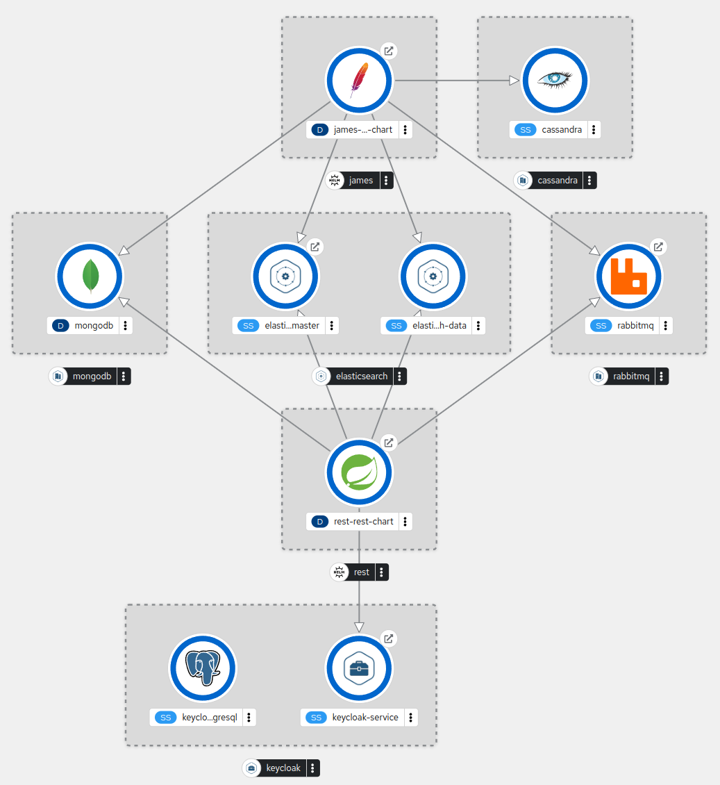

# <div align="center">  Disposable Email Project </div>

<div align="center">


![Apache James](https://img.shields.io/badge/apache_james-2F3134?style=for-the-badge&logo=data:image/svg+xml;base64,PD94bWwgdmVyc2lvbj0iMS4wIiBlbmNvZGluZz0idXRmLTgiPz4KPHN2ZyB2aWV3Qm94PSItOC4xMjYgMTUuODE3IDExOC42IDExOC42IiB4bWxucz0iaHR0cDovL3d3dy53My5vcmcvMjAwMC9zdmciPgogIDxsaW5lYXJHcmFkaWVudCBpZD0iU1ZHSURfMV8iIGdyYWRpZW50VW5pdHM9InVzZXJTcGFjZU9uVXNlIiB4MT0iOC4wMjk4IiB5MT0iNzgzLjY2MTkiIHgyPSI0Ni4xMzM2IiB5Mj0iNzgzLjY2MTkiIGdyYWRpZW50VHJhbnNmb3JtPSJtYXRyaXgoLTAuMTAwOCAtMC45OTQ5IC0wLjk5NDkgMC4xMDA4IDYyMy43MTc5IDI5Mi43ODE0KSI+CiAgICA8c3RvcCBvZmZzZXQ9IjAiIHN0eWxlPSJzdG9wLWNvbG9yOiNGQkMzMTUiLz4KICAgIDxzdG9wIG9mZnNldD0iMC40OTY5IiBzdHlsZT0ic3RvcC1jb2xvcjojRTc0QTI0Ii8+CiAgICA8c3RvcCBvZmZzZXQ9IjEiIHN0eWxlPSJzdG9wLWNvbG9yOiNFNDI2MkEiLz4KICA8L2xpbmVhckdyYWRpZW50PgogIDxjaXJjbGUgY2xhc3M9InN0MiIgY3g9Ii0xNDEuMSIgY3k9IjM0Mi4zIiByPSI1OS4zIiBzdHlsZT0iZmlsbDogcmdiKDI1NSwgMjU1LCAyNTUpOyIgdHJhbnNmb3JtPSJtYXRyaXgoMSwgMCwgMCwgMSwgMTkyLjI3MzcxMiwgLTI2Ny4xODI2MTcpIi8+CiAgPHBhdGggY2xhc3M9InN0MyIgZD0iTS0xMDAuMiwzMTcuOWMtMy4yLTIuMS02LjUtMy45LTkuOS00LjdjLTMuNC0wLjktNy0wLjctMTAuMiwwLjdsLTAuNiwwLjNsLTAuMywwLjFsLTAuMiwwLjFsLTAuMSwwbDAsMGwwLDAgYzAsMC0wLjEsMCwwLDBsMCwwYy0wLjQsMC4zLTAuOSwwLjUtMS4zLDAuN2MtMC45LDAuNS0xLjgsMC45LTIuNywxLjJjLTEuOSwwLjYtMy44LDEuMS01LjksMC45Yy0xLTAuMS0yLTAuNS0yLjktMS4xIGMtMC45LTAuNi0xLjUtMS40LTItMi4zYy0wLjktMS44LTEuMi0zLjctMS4zLTUuNmMwLjMsMS45LDAuOSwzLjcsMS45LDUuMmMwLjUsMC43LDEuMiwxLjQsMS45LDEuOGMwLjgsMC40LDEuNiwwLjYsMi41LDAuNyBjMS43LDAuMSwzLjUtMC40LDUuMi0xLjJjMC44LTAuNCwxLjYtMC44LDIuNC0xLjJjMC40LTAuMiwwLjgtMC41LDEuMS0wLjdsMC43LTAuNGMwLjItMC4xLDAuNC0wLjMsMC43LTAuNCBjMS44LTEsMy44LTEuNiw1LjgtMS43YzItMC4xLDQuMSwwLjEsNiwwLjhjMS45LDAuNiwzLjcsMS42LDUuMiwyLjhDLTEwMi42LDMxNC45LTEwMS4yLDMxNi4zLTEwMC4yLDMxNy45eiIgc3R5bGU9ImZpbGw6IHJnYigyMzEsIDc0LCAzNik7IiB0cmFuc2Zvcm09Im1hdHJpeCgxLCAwLCAwLCAxLCAxOTIuMjczNzEyLCAtMjY3LjE4MjYxNykiLz4KICA8cGF0aCBjbGFzcz0ic3Q1IiBkPSJNLTE1Mi44LDM1My4xYy0xMi43LTkuNi0yMS4yLTE5LjctMjAuOS0yMGMwLjMtMC4zLDkuMiw5LjMsMjEuOCwxOC44YzMuNywyLjgsNy4zLDUuMywxMC41LDcuNCBjMC0wLjEsMC4xLTAuMSwwLjEtMC4yYzAuNS0xLDAuOS0yLjEsMS4yLTMuMmMtMi4zLTQuNS03LjktMTAuOC0xNC40LTE2LjVjLTEuNS0xLjMtMy0yLjQtNC41LTMuNGMtMC4zLDIuNy0xLDQuNi0xLDQuNiBjMCwwLTAuNy0yLjYtMC43LTUuN2MtMS0wLjYtMi4xLTEuMi0zLjEtMS43YzAsMy4xLTAuOSw1LjQtMC45LDUuNGMwLDAtMS44LTMuMS0yLTYuOGMwLDAsMCwwLDAtMC4xYy02LjEtMi44LTExLjMtNC4yLTExLjMtNC4yIGMtMC4xLTAuMSwwLjQsMTMsMTAuMSwyM2MwLjMsMCwwLjcsMCwxLDBjMy41LDAsNi41LDEuMyw2LjUsMS4zYzAsMC0xLjgsMS4xLTQuNiwxLjVjMSwwLjgsMiwxLjUsMywyLjFjMi41LTAuOSw0LjctMS4yLDQuNy0xLjIgYzAsMC0xLjEsMS4xLTMsMi4yYzYuNywzLjcsMTIuOCw1LjYsMTYuNyw1LjhjMC41LTAuNiwxLTEuMiwxLjQtMS44Qy0xNDUuNCwzNTguNC0xNDksMzU2LTE1Mi44LDM1My4xeiIgc3R5bGU9ImZpbGw6IHVybCgjU1ZHSURfMV8pOyIgdHJhbnNmb3JtPSJtYXRyaXgoMSwgMCwgMCwgMSwgMTkyLjI3MzcxMiwgLTI2Ny4xODI2MTcpIi8+CiAgPHBhdGggY2xhc3M9InN0NiIgZD0iTS0xMDcuNSwzMTcuN2MtMi40LDAuMi00LjksMC42LTcuMywxLjNjLTQuOCwxLjQtOS41LDMuOC0xMy40LDcuNWMtMiwxLjgtMy42LDQtNSw2LjMgYy0xLjQsMi4zLTIuNSw0LjgtMy4yLDcuNGMtMC43LDIuNi0xLjIsNS4yLTEuMyw3LjhjMCwwLjYtMC4xLDEuMy0wLjEsMmwwLDAuOWwwLDAuOGMwLDEtMC4xLDItMC4zLDNjLTAuMSwwLjctMC4zLDEuNS0wLjUsMi4yIGMtMC4zLDEuMS0wLjcsMi4yLTEuMiwzLjJjMCwwLjEtMC4xLDAuMS0wLjEsMC4yYy0wLjIsMC40LTAuNSwwLjgtMC43LDEuMWMtMC40LDAuNi0wLjksMS4yLTEuNCwxLjhjLTAuNCwwLjQtMC44LDAuOC0xLjIsMS4yIGMtMi45LDIuNS02LjksNC4zLTExLjEsNS40Yy00LjMsMS4xLTguOSwxLjctMTMuNSwyLjFjLTQuNywwLjMtOS40LDAuNC0xNC4yLDAuMmM0LjUsMS44LDkuMiwyLjksMTQsMy43IGM0LjgsMC43LDkuOCwwLjksMTQuOCwwLjNjMi41LTAuMyw1LjEtMC45LDcuNi0xLjhjMi41LTAuOSw1LTIuMSw3LjItMy44YzIuMy0xLjcsNC4yLTMuOSw1LjctNi40YzAuNy0xLjMsMS4zLTIuNiwxLjgtMy45IGMwLjUtMS4zLDAuOC0yLjcsMS00LjFjMC4yLTEuNCwwLjQtMi43LDAuNC00LjFjMC0wLjMsMC0wLjcsMC0xbDAtMC45YzAtMC41LDAtMSwwLTEuNmMwLjEtMi4xLDAuNC00LjIsMC44LTYuMiBjMC45LTQsMi43LTcuOCw1LjMtMTFjMi42LTMuMiw2LjEtNiwxMC4xLTguMmM0LTIuMiw4LjMtMy45LDEzLTUuMkMtMTAyLjYsMzE3LjUtMTA1LDMxNy41LTEwNy41LDMxNy43eiIgc3R5bGU9ImZpbGw6IHJnYigyMjgsIDM4LCA0Mik7IiB0cmFuc2Zvcm09Im1hdHJpeCgxLCAwLCAwLCAxLCAxOTIuMjczNzEyLCAtMjY3LjE4MjYxNykiLz4KPC9zdmc+)
![OpenAPI Generator](https://img.shields.io/badge/OpenAPI_Generator-2F3134?style=for-the-badge&logo=data:image/svg+xml;base64,PD94bWwgdmVyc2lvbj0iMS4wIiBlbmNvZGluZz0iVVRGLTgiIHN0YW5kYWxvbmU9Im5vIj8+CjwhRE9DVFlQRSBzdmcgUFVCTElDICItLy9XM0MvL0RURCBTVkcgMS4xLy9FTiIgImh0dHA6Ly93d3cudzMub3JnL0dyYXBoaWNzL1NWRy8xLjEvRFREL3N2ZzExLmR0ZCI+Cjxzdmcgd2lkdGg9IjEwMCUiIGhlaWdodD0iMTAwJSIgdmlld0JveD0iMCAwIDE3NDkgMTc0OSIgdmVyc2lvbj0iMS4xIiB4bWxucz0iaHR0cDovL3d3dy53My5vcmcvMjAwMC9zdmciIHhtbG5zOnhsaW5rPSJodHRwOi8vd3d3LnczLm9yZy8xOTk5L3hsaW5rIiB4bWw6c3BhY2U9InByZXNlcnZlIiB4bWxuczpzZXJpZj0iaHR0cDovL3d3dy5zZXJpZi5jb20vIiBzdHlsZT0iZmlsbC1ydWxlOmV2ZW5vZGQ7Y2xpcC1ydWxlOmV2ZW5vZGQ7c3Ryb2tlLWxpbmVqb2luOnJvdW5kO3N0cm9rZS1taXRlcmxpbWl0OjEuNDE0MjE7Ij4KICAgIDxnIHRyYW5zZm9ybT0ibWF0cml4KDEsMCwwLDEsLTU5Mi40NTgsLTI1OC42NjgpIj4KICAgICAgICA8ZyBpZD0iRmluYWwiPgogICAgICAgICAgICA8ZyBpZD0iV3JlbmNoLUZpbmFsIiBzZXJpZjppZD0iV3JlbmNoIEZpbmFsIiB0cmFuc2Zvcm09Im1hdHJpeCgwLjcwNzEwNywtMC43MDcxMDcsMC43MDcxMDcsMC43MDcxMDcsLTM4OC40NzgsMTM2Mi4xMykiPgogICAgICAgICAgICAgICAgPHBhdGggZD0iTTIwNTAsMTI2Ny41TDIwNTAsMTM1MEwxNjUwLDE3NTBDMTUyMS4yOSwxNzUwIDEzNzguNzEsMTc1MCAxMjUwLDE3NTBMODg1LDEzODVMNDcyLjI1MywxMzg1TDQ3Mi4yNTMsOTE1TDg4NSw5MTVMMTI1MCw1NTBMMTY1MCw1NTBMMjA1MCw5NTBMMjA1MCwxMDMyLjVMMTc3OS43NiwxMDMyLjVDMTczMS40Myw4OTcuMDUyIDE2MDEuOTYsODAwIDE0NTAsODAwQzEyNTYuODMsODAwIDExMDAsOTU2LjgzIDExMDAsMTE1MEMxMTAwLDEzNDMuMTcgMTI1Ni44MywxNTAwIDE0NTAsMTUwMEMxNjAxLjk2LDE1MDAgMTczMS40MywxNDAyLjk1IDE3NzkuNzYsMTI2Ny41TDIwNTAsMTI2Ny41WiIgc3R5bGU9ImZpbGw6cmdiKDE1OSwxOTcsODQpOyIvPgogICAgICAgICAgICA8L2c+CiAgICAgICAgICAgIDxnIGlkPSJJbnRlcmZhY2UtRmluYWwiIHNlcmlmOmlkPSJJbnRlcmZhY2UgRmluYWwiIHRyYW5zZm9ybT0ibWF0cml4KDAuNzA3MTA3LC0wLjcwNzEwNywwLjcwNzEwNywwLjcwNzEwNywtMzg4LjQ3OCwxMzYyLjEzKSI+CiAgICAgICAgICAgICAgICA8cGF0aCBkPSJNMjIzNi45MiwxMDkwQzIyNjIuNDMsMTAwOC44OSAyMzM4LjI2LDk1MCAyNDI3Ljc1LDk1MEMyNTM4LjEzLDk1MCAyNjI3Ljc1LDEwMzkuNjIgMjYyNy43NSwxMTUwQzI2MjcuNzUsMTI2MC4zOCAyNTM4LjEzLDEzNTAgMjQyNy43NSwxMzUwQzIzMzguMjYsMTM1MCAyMjYyLjQzLDEyOTEuMTEgMjIzNi45MiwxMjEwTDE2NDAuODMsMTIxMEMxNjE1LjMyLDEyOTEuMTEgMTUzOS40OCwxMzUwIDE0NTAsMTM1MEMxMzM5LjYyLDEzNTAgMTI1MCwxMjYwLjM4IDEyNTAsMTE1MEMxMjUwLDEwMzkuNjIgMTMzOS42Miw5NTAgMTQ1MCw5NTBDMTUzOS40OCw5NTAgMTYxNS4zMiwxMDA4Ljg5IDE2NDAuODMsMTA5MEwyMjM2LjkyLDEwOTBaIiBzdHlsZT0iZmlsbDpyZ2IoNjYsNjUsNjcpOyIvPgogICAgICAgICAgICA8L2c+CiAgICAgICAgPC9nPgogICAgPC9nPgo8L3N2Zz4K)


![Elasticsearch](https://img.shields.io/badge/elasticsearch-2F3134?style=for-the-badge&logo=data:image/svg+xml;base64,PD94bWwgdmVyc2lvbj0iMS4wIiBlbmNvZGluZz0idXRmLTgiPz4KPHN2ZyB2aWV3Qm94PSIxMzkuMzk2IDExNS40MTcgODAgODAiIHhtbG5zPSJodHRwOi8vd3d3LnczLm9yZy8yMDAwL3N2ZyI+CiAgPGNsaXBQYXRoIGlkPSJTVkdJRF8yXyI+CiAgICA8Y2lyY2xlIGN4PSI0MCIgY3k9IjQwIiByPSIzMiIgdHJhbnNmb3JtPSJtYXRyaXgoMSwgMCwgMCwgMSwgMCwgMCkiIG92ZXJmbG93PSJ2aXNpYmxlIi8+CiAgPC9jbGlwUGF0aD4KICA8Y2xpcFBhdGggaWQ9IlNWR0lEXzRfIj4KICAgIDxjaXJjbGUgY3g9IjQwIiBjeT0iNDAiIHI9IjMyIiB0cmFuc2Zvcm09Im1hdHJpeCgxLCAwLCAwLCAxLCAwLCAwKSIgb3ZlcmZsb3c9InZpc2libGUiLz4KICA8L2NsaXBQYXRoPgogIDxwYXRoIGNsYXNzPSJzdDAiIGQ9Ik01My43IDI2SDEwYy0xLjEgMC0yLS45LTItMlYxMGMwLTEuMS45LTIgMi0yaDU3YzEuMSAwIDIgLjkgMiAydi43QzY4LjkgMTkuMSA2Mi4xIDI2IDUzLjcgMjZ6IiB0cmFuc2Zvcm09Im1hdHJpeCgxLCAwLCAwLCAxLCAxMzkuMzk2MDg4LCAxMTUuNDE3Mzk3KSIgc3R5bGU9ImNsaXAtcGF0aDogdXJsKCNTVkdJRF8yXyk7IGZpbGw6IHJnYigyNDAsIDE5MSwgMjYpOyIvPgogIDxwYXRoIGNsYXNzPSJzdDEiIGQ9Ik02OS4xIDcySDguMlY1NGg0NS43YzguNCAwIDE1LjIgNi44IDE1LjIgMTUuMlY3MnoiIHRyYW5zZm9ybT0ibWF0cml4KDEsIDAsIDAsIDEsIDEzOS4zOTYwODgsIDExNS40MTczOTcpIiBzdHlsZT0iY2xpcC1wYXRoOiB1cmwoI1NWR0lEXzRfKTsgZmlsbDogcmdiKDYyLCAxOTAsIDE3Nik7Ii8+CiAgPGcgdHJhbnNmb3JtPSJtYXRyaXgoMSwgMCwgMCwgMSwgMTM5LjM5NjA4OCwgMTE1LjQxNzM5NykiPgogICAgPGRlZnM+CiAgICAgIDxjaXJjbGUgaWQ9IlNWR0lEXzVfIiBjeD0iNDAiIGN5PSI0MCIgcj0iMzIiLz4KICAgIDwvZGVmcz4KICAgIDxjbGlwUGF0aCBpZD0iU1ZHSURfNl8iPgogICAgICA8Y2lyY2xlIGN4PSI0MCIgY3k9IjQwIiByPSIzMiIgdHJhbnNmb3JtPSJtYXRyaXgoMSwgMCwgMCwgMSwgMCwgMCkiIG92ZXJmbG93PSJ2aXNpYmxlIi8+CiAgICA8L2NsaXBQYXRoPgogICAgPHBhdGggY2xhc3M9InN0MiIgZD0iTTUwLjEgNDlINC44VjMxaDQ1LjNjNSAwIDkgNCA5IDlzLTQuMSA5LTkgOXoiIHN0eWxlPSJjbGlwLXBhdGg6IHVybCgjU1ZHSURfNl8pOyBmaWxsOiByZ2IoNywgMTY1LCAyMjIpOyIvPgogIDwvZz4KICA8ZyB0cmFuc2Zvcm09Im1hdHJpeCgxLCAwLCAwLCAxLCAxMzkuMzk2MDg4LCAxMTUuNDE3Mzk3KSI+CiAgICA8ZGVmcz4KICAgICAgPGNpcmNsZSBpZD0iU1ZHSURfN18iIGN4PSI0MCIgY3k9IjQwIiByPSIzMiIvPgogICAgPC9kZWZzPgogICAgPGNsaXBQYXRoIGlkPSJTVkdJRF84XyI+CiAgICAgIDxjaXJjbGUgY3g9IjQwIiBjeT0iNDAiIHI9IjMyIiB0cmFuc2Zvcm09Im1hdHJpeCgxLCAwLCAwLCAxLCAwLCAwKSIgb3ZlcmZsb3c9InZpc2libGUiLz4KICAgIDwvY2xpcFBhdGg+CiAgICA8cGF0aCBjbGFzcz0ic3QzIiBkPSJNMzYgMzFINi40djE4SDM2Yy43LTIuNyAxLjEtNS43IDEuMS05cy0uNC02LjMtMS4xLTl6IiBzdHlsZT0iY2xpcC1wYXRoOiB1cmwoI1NWR0lEXzhfKTsgZmlsbDogcmdiKDM1LCAzMSwgMzIpOyIvPgogIDwvZz4KICA8cGF0aCBjbGFzcz0ic3Q0IiBkPSJNMjMuOSAxMi4zYy01LjQgMy4yLTkuOSA4LTEyLjcgMTMuN2gyMy42Yy0yLjQtNS41LTYuMi0xMC4xLTEwLjktMTMuN3oiIHRyYW5zZm9ybT0ibWF0cml4KDEsIDAsIDAsIDEsIDEzOS4zOTYwODgsIDExNS40MTczOTcpIiBzdHlsZT0iZmlsbDogcmdiKDIxNSwgMTYyLCA0MSk7Ii8+CiAgPHBhdGggY2xhc3M9InN0NSIgZD0iTTI0LjkgNjguMmM0LjYtMy43IDguMy04LjYgMTAuNi0xNC4ySDExLjJjMyA2IDcuOCAxMSAxMy43IDE0LjJ6IiB0cmFuc2Zvcm09Im1hdHJpeCgxLCAwLCAwLCAxLCAxMzkuMzk2MDg4LCAxMTUuNDE3Mzk3KSIgc3R5bGU9ImZpbGw6IHJnYigxLCAxNTUsIDE0Myk7Ii8+CiAgPHBhdGggY2xhc3M9InN0NiIgZD0iTTAgMGg4MHY4MEgweiIgdHJhbnNmb3JtPSJtYXRyaXgoMSwgMCwgMCwgMSwgMTM5LjM5NjA4OCwgMTE1LjQxNzM5NykiIHN0eWxlPSJmaWxsOiBub25lOyIvPgo8L3N2Zz4=)


</div>

## Project information

:e-mail: The `Disposable Email Project` contains an API for creating temporary email accounts and getting a list of messages.
Processing emails is based on distributed [Apache James](https://james.apache.org/) - Java Apache Mail Enterprise Server 
(`Cassandra` for meta-data storage + `ElasticSearch` for search + `RabbitMQ` for messaging).
Incoming messages are processed and added to the `MongoDB` database.

<p align="center">
  
</p>


## Requirements

The following software is required for the complete workflow (from git clone to running Docker containers and 
deploying apps to a k8s cluster).
The specified versions are the tested ones.

* JDK 17+
* Git 2.25.1+
* Apache Maven 3.6.3+
* Docker 20.10.18+
* Docker compose 2.5.0+
* Helm 3.10.2+

## Using Docker

Running [Apache James](apache-james/README.md) with third party dependencies:

* Cassandra
* Elasticsearch
* Kibana
* RabbitMQ
* MongoDB
* Keycloak

```bash
docker compose -f apache-james/docker-compose.yml up
```

## Using Kubernetes
[Deploying K8S](k8s/README.md)

## Mailets
[Description & Performance](apache-james/extensions/mailets/README.md) 
